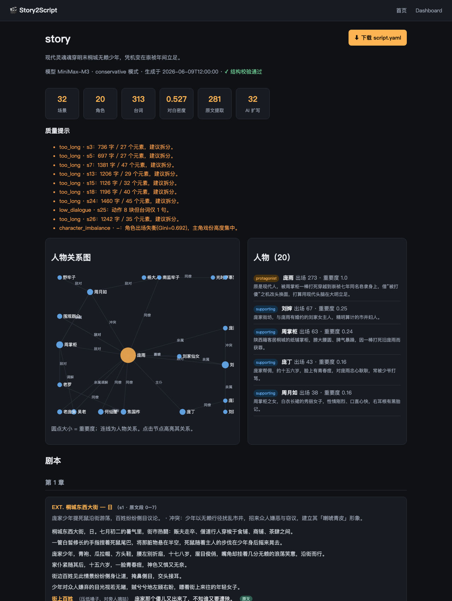
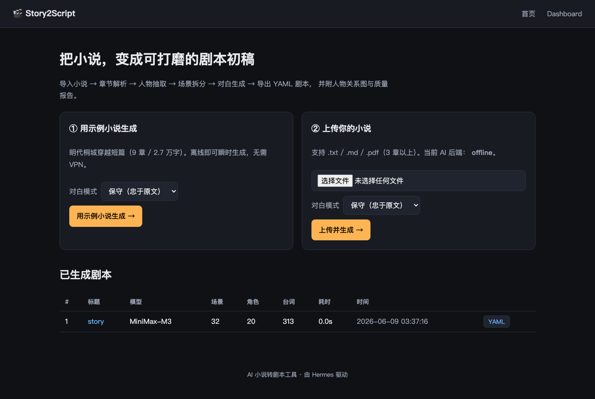
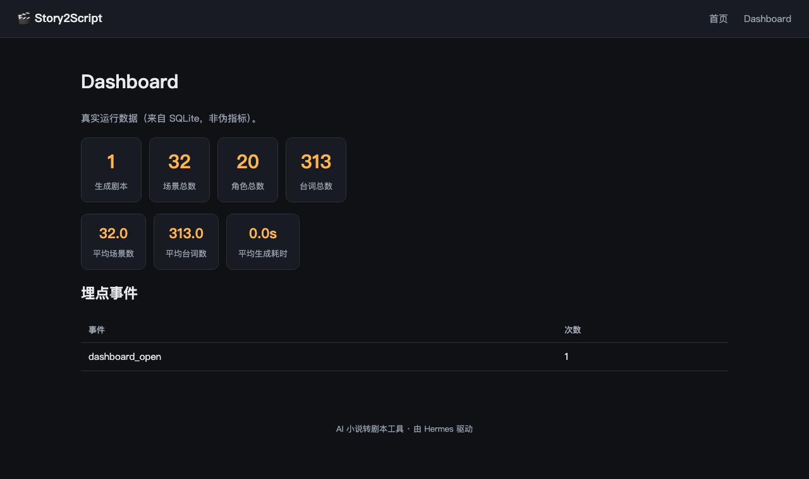

# Story2Script · AI 小说转剧本工具

把 **3 章以上的小说**自动转换为**结构化剧本（YAML）**，让作者快速拿到可编辑、可打磨的剧本初稿，并附**人物关系图**与**剧本质量报告**。

> 七牛云校招题目三实现。技术栈：Python 3.11 · Flask + gevent · SQLite · Hermes(MiniMax-M3)。



---

## 1. 它解决什么

小说作者拥有完整故事，却常缺剧本经验：

| 痛点 | Story2Script 的对应能力 |
|---|---|
| 连续叙事难拆场景 | 按**时间/地点/事件**自动拆分场景，生成行业 slugline |
| 心理描写多、对白少 | 提取原有对白 + 把心理活动**扩写**为台词 |
| 缺镜头感 | 叙述转为 `action / dialogue / transition` 元素流 |
| 剧本格式复杂 | 一键导出规范的结构化 YAML |
| 不知道改得好不好 | 人物关系图 + 可计算的质量报告 |

它**不是格式转换器**，而是一个 AI 编剧助手——目标是给作者一份"可继续打磨"的初稿，而非照搬原文。

## 2. 功能特性

- 📥 **小说导入**：`.txt` / `.md` / `.pdf`，自动识别章节（含"首章无标题"等真实排版）
- 👤 **人物抽取**：角色卡（人设/目标/弧线），出场次数与重要度**在原文上真实统计**
- 🕸 **Story Graph**：人物关系图，前端力导向可视化（零外部依赖）
- 🎬 **场景拆分**：时间/地点/事件驱动，每场带**原文段落溯源**
- 💬 **对白生成**：保守 / 创作两种模式；每句台词标注 `extracted`(原文) / `expanded`(AI 扩写)，且**由程序在原文上复核**，不可伪标
- 📄 **YAML 导出**：人可读、机可解析，附 [Schema 文档](yaml_schema.md)
- ✅ **质量检查**：场景过长 / 对白过少 / 角色失衡(Gini) / 原文覆盖率，全部可计算、非伪指标
- 📊 **Dashboard**：真实运行统计 + 埋点

## 3. 架构

```
小说文件
  │  parser            章节解析 / 段落切分（确定性，无 AI）
  ▼
Novel ──► AIService（可插拔：Hermes / 离线回放 / 录制）
  │         │
  │         ├─ character_extractor   人物 + 关系图
  │         ├─ scene_planner         场景拆分（带溯源）
  │         └─ dialogue_generator    对白（提取+扩写，mode 复核）
  ▼
script_generator   组装 → 引用消解
  │
  ├─ quality_checker   质量检查 / 覆盖率
  ├─ schema            jsonschema 校验
  └─ yaml_exporter     导出 script.yaml
  ▼
Flask Web UI（上传 · 剧本视图 · Story Graph · Dashboard）  ◄── SQLite 持久化 & 埋点
```

每一步可单独替换与测试；所有 AI 调用都经过 `AIService` 抽象。

## 4. 快速开始

```bash
python3.11 -m venv .venv && source .venv/bin/activate
pip install -r requirements.txt
cp .env.example .env
```

### 两种运行模式

| 模式 | 说明 | 适用 |
|---|---|---|
| `offline`（推荐先试） | 回放仓库内置 fixture，**无需网络**、瞬时、结果确定 | 无 VPN 时跑 demo / 单测 |
| `hermes`（默认） | 调用 Hermes 平台（需公司内网/VPN）用 MiniMax-M3 真实生成 | 处理任意新小说 |

启动 Web：

```bash
# 离线模式：打开即可看到内置示例剧本，点「用示例小说生成」可瞬时重跑流水线
STORY2SCRIPT_AI_BACKEND=offline python -m story2script.app
# 浏览器打开 http://127.0.0.1:8000
```

> 离线模式只对仓库内置的示例小说有 fixture；要处理**你自己的小说**，把 `.env` 里
> `STORY2SCRIPT_AI_BACKEND` 设为 `hermes`（需连内网），再上传文件即可。

命令行直接生成：

```bash
STORY2SCRIPT_AI_BACKEND=offline python -c "from story2script.ai_service import AIService; \
from story2script.parser import parse_novel; from story2script.pipeline import run_pipeline; \
from story2script.yaml_exporter import export_script; \
export_script(run_pipeline(parse_novel('samples/story.txt'), AIService()), 'out.yaml')"
```

### 跑测试

```bash
pytest            # 默认离线后端，不依赖网络
```

### 录制离线 fixture（可选）

离线 fixture 来自真实模型输出，"录制一次、离线回放"，并非手写假数据：

```bash
python -m story2script.tools.record samples/story.txt        # 需内网/VPN
```

## 5. 项目结构

```
story2script/
  parser.py            章节/段落解析
  ai_service.py        可插拔 AI 接入（Hermes/offline/record）+ JSON 容错
  character_extractor  人物抽取 + Story Graph
  scene_planner.py     场景拆分（溯源）
  dialogue_generator   对白提取/扩写 + mode 复核
  script_generator.py  组装为剧本字典
  quality_checker.py   质量检查 / 覆盖率
  schema.py            剧本 JSON Schema 校验
  yaml_exporter.py     YAML 导出
  pipeline.py          端到端流水线
  app.py + templates/ + static/   Web UI
  db.py                SQLite 持久化 + 埋点
  fixtures/            离线回放用的真实模型输出
samples/   story.txt（示例小说） · script.yaml（真实生成的剧本产物）
tests/     77 个单测
yaml_schema.md  剧本 YAML Schema 定义与设计理由（题目必交）
design.md       总体设计
DEMO.md         演示脚本
```

## 6. 设计亮点

- **可插拔 AI + 离线回放**：Hermes 是内网服务，评审者本地不一定能连。可插拔后端 + 录制/回放让 demo 与单测**无网络也能确定性运行**，且 fixture 是真实模型输出，诚实可查。
- **反造假是一等公民**：
  - 每条对白标 `mode: extracted|expanded`，且**由程序在原文上复核**（公共子串），模型谎标会被纠正；
  - 每个场景记 `source: {chapter, span}`，可逐句回查原文。
- **指标都可计算**：出场次数、重要度、对白密度、原文覆盖率、角色失衡 Gini——全部从结构算出，不让模型自评，避免伪指标。
- **健壮性**：解析处理首章无标题；JSON 解析容忍中文引号被写成 ASCII `"`、代码围栏、截断重试。

详见 [`yaml_schema.md`](yaml_schema.md)（Schema 设计理由）与 [`design.md`](design.md)。

## 7. 截图

| 首页 | Dashboard |
|---|---|
|  |  |

## 8. 商业化思考

- **个人版**：小说作者改编自用（当前形态）。
- **专业版**：编剧工作室协作、版本管理、导出 Fountain/FDX 对接专业排版。
- **企业版**：网文平台 / 影视 / 动画公司批量预评估 IP 的"可改编性"。
- **API 版**：Novel-to-Script 服务，按量计费。

产品取舍：本期**只做扎实的核心链路 + 两个创新点（关系图、质量检查）**，A/B（粗/细粒度、保守/创作）与评估框架以"接口预留 + 可计算指标"呈现，不堆砌半成品功能。

## 9. 安全 · AI 声明 · 局限

- **安全**：不提交任何密钥/token/cookie/Hermes 认证信息；配置统一走 `.env`（已在 `.gitignore`）。
- **AI 辅助声明**：本项目在 Claude Code 辅助下开发，核心设计与实现均经人工审阅，保证实现与文档一致。AI 生成的对白在剧本里以 `mode: expanded` 显式标注。示例小说由用户提供，非抄袭。
- **已知局限 / 未来工作**：说话人**指代消解**（"周家女子"=周月如）目前仅做精确匹配，未消解的保留原称并如实计数（见 `quality_report.unresolved_speakers`）；语义级 coreference 列为后续改进。
